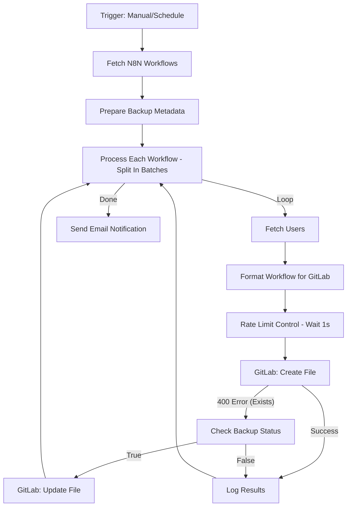
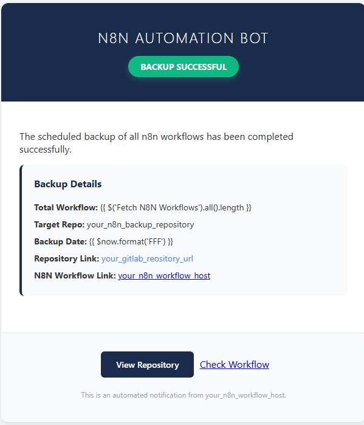

# N8N Automated Workflow Backup to GitLab
This solution provides a robust, automated mechanism for version-controlling your self-hosted n8n workflows. It synchronizes your workflows with a GitLab repository, organizing them by user/creator to ensure clarity and easy recovery.

## 🚀 Overview
The workflow acts as a bridge between your n8n instance and GitLab. It periodically fetches all workflows, categorizes them based on naming conventions (or tags), and commits changes to a dedicated repository.

### Key Features
- **True Owner Separation**: Automatically identifies workflows based on the owner's email retrieved via the n8n API.
- **Creator Metadata**: Extracts the actual n8n `userId` and maps it to user details from the N8N Users API.
- **Differential Backup**: Checks for file existence in GitLab; updates existing definitions or creates new ones.
- **Detailed Notifications**: Sends a professional HTML report with a summary of the backup process.

---

## 🛠️ Operational Process


### Node breakdown
1.  **Triggers**: Supports both manual execution and a daily schedule (Midnight and 12:00 PM).
2.  **Retrieval**: Uses the **"Fetch N8N Workflows"** node to pull all workflow definitions from the n8n API.
3.  **Metadata Prep**: Sets global variables like GitLab project owner (`idstar-project/devops/automation`) and repository path (`n8n-global-backup`).
4.  **Processing Loop**:
    *   **User Resolution**: The **"Fetch Users"** node retrieves the list of n8n users to map `userId` to a human-readable email/name.
    *   **Formatting**: The **"Format Workflow for GitLab"** node prepares the payload:
        - **Creator Name**: Extracts the username from the email.
        - **Folder Name**: Uses the first tag assigned to the workflow (defaults to `General`).
        - **File Path**: structured as `workflows/{{ workflowName }}/{{ workflowName }}.json`.
    *   **Git Operations**: Attempts to create the file. If it fails due to existing content, it falls back to an update operation.
5.  **Notification**: Generates a summary and sends a status report via SMTP Credentials.

---

## 📋 Requirements
- **GitLab**: 
  - A project (e.g., `idstar-project/devops/automation/n8n-global-backup`).
  - Personal Access Token or OAuth2 with `api` and `write_repository` scopes.
- **n8n**:
  - API Key with Read access to workflows and users.
  - SMTP credentials for notifications.

---

## ⚙️ Implementation Guide

### 1. Credentials Setup
Ensure the following credentials are configured in your n8n instance:
- `N8N_API_KEY`: For workflow and user retrieval.
- `gitlab.com`: GitLab OAuth2/Token credentials.
- `SMTP Credentials`: For sending notifications.

### 2. Core Expressions (Metadata Extraction)
The **"Format Workflow for GitLab"** node uses these specific expressions:

**Creator Name (`creatorName`):**
*Extracts the part before the @ in the email.*
```javascript
{{ ($('Fetch Users').first().json.data.find(u => u.id === ($('Fetch N8N Workflows').item.json.owner?.id || $('Fetch N8N Workflows').item.json.userId))?.email?.split('@')[0] || 'general').toLowerCase() }}
```

**Clean Workflow Name:**
```javascript
{{ $('Fetch N8N Workflows').item.json.name }}.json
```

**File Path (`filePath`):**
```javascript
workflows/{{ $('Fetch N8N Workflows').item.json.name }}/{{ $('Fetch N8N Workflows').item.json.name }}.json
```

### 3. Repository Settings
Edit the **"Prepare Backup Metadata"** node to update:
- `gitlabprojectOwner`: The namespace/group in GitLab.
- `gitlabprojectPath`: The repository name.

---

## 📊 Notification Preview
The workflow sends an HTML email via the **"Send email"** node containing a high-level **Backup Summary**.

### Backup Summary Fields:
- **Total Workflow**: The total number of flows retrieved (`{{ $('Fetch N8N Workflows').all().length }}`).
- **Target Repo**: Destination repository (`n8n-global-backup`).
- **Backup Date**: Completion timestamp (`{{ $now.format('FFF') }}`).
- **Repository Link**: Direct link to the GitLab project.



---

## Reference
- Original Workflow: [Automated n8n workflows backup on GitLab with username organization](https://n8n.io/workflows/5616-automated-n8n-workflows-backup-on-gitlab-with-username-organization/)